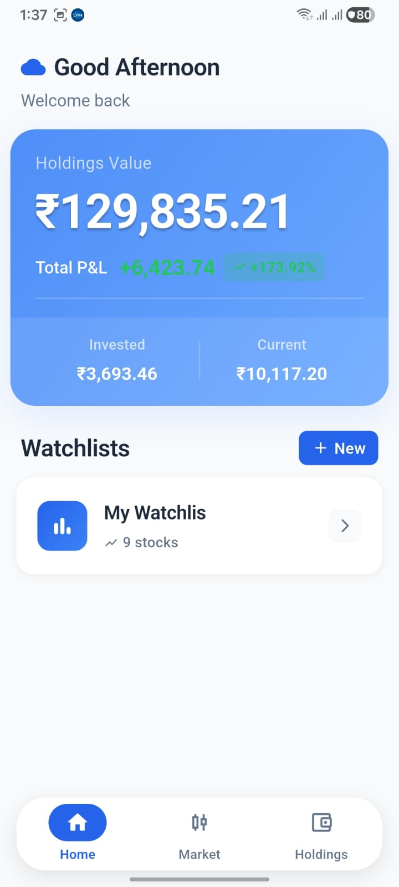
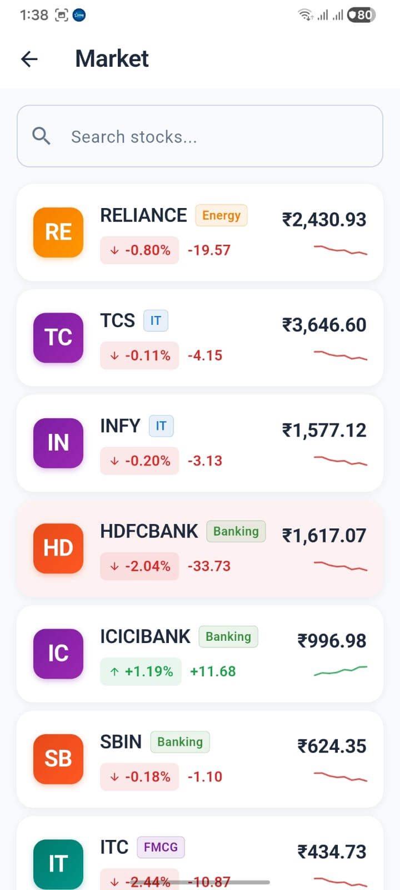
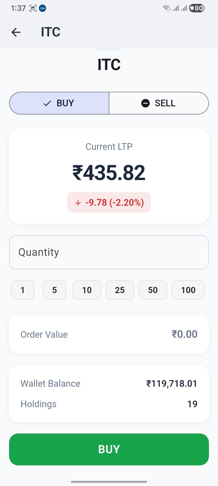
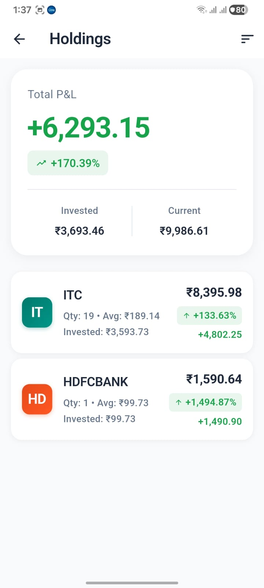
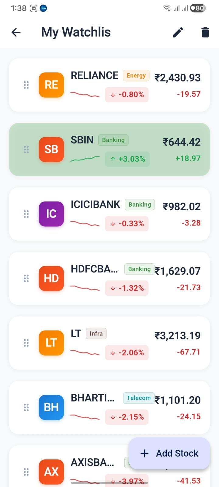
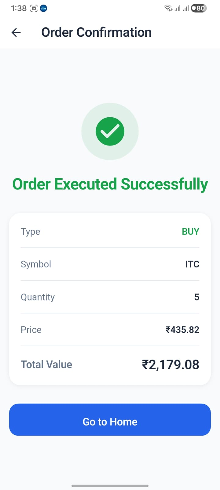

# Flutter Trading App

A modern, high-performance mobile trading application built with Flutter. This app simulates a complete trading experience with real-time market feeds, portfolio management, and order execution. Designed with clean architecture principles and optimized for 60 FPS performance on mobile devices.

---

## Features

### 1. Watchlists

Create and manage multiple stock watchlists with full CRUD operations:

- **Multiple Watchlists**: Organize stocks across different watchlists
- **Add/Remove Stocks**: Pick from 10 available NSE stocks
- **Rename Watchlists**: Customize watchlist names
- **Drag & Drop Reordering**: Rearrange stocks within watchlists using intuitive drag gestures
- **Live Price Updates**: Real-time price feeds with change indicators
- **Persistent Storage**: All watchlists saved locally using Hive database
- **Stock Management**: Delete individual stocks or entire watchlists

### 2. Live Market

Real-time market feed with optimized performance:

- **Mock Market Service**: Simulates live NSE stock price movements
- **10 NSE Stocks**: RELIANCE, TCS, INFY, HDFCBANK, ICICIBANK, SBIN, ITC, LT, BHARTIARTL, AXISBANK
- **Flash Animations**: Visual feedback on price changes (green for up, red for down)
- **Single Source of Truth**: Centralized market data stream using Riverpod
- **Optimized Rendering**: RepaintBoundary and selective rebuilds for smooth 60 FPS
- **Search Functionality**: Debounced search with instant filtering
- **Price Validation**: All prices clamped between ₹1 and ₹100,000

### 3. Buy / Sell

Complete order execution system with validation:

- **Market Orders**: Execute buy/sell orders at current market price
- **Wallet Integration**: Initial balance of ₹10,00,000
- **Wallet Validation**: Prevents purchases exceeding available balance
- **Holdings Validation**: Prevents selling more shares than owned
- **Order History**: Track all executed trades
- **Live Price Display**: Current LTP with change percentage
- **Decimal-Safe Calculations**: Uses Decimal package for precise financial calculations
- **Order Confirmation**: Visual feedback with animated confirmation screen
- **Average Cost Tracking**: Maintains weighted average cost for holdings

### 4. Holdings

Portfolio management with live updates:

- **Live Portfolio Value**: Real-time calculation of total portfolio worth
- **Profit & Loss**: Individual and total P&L with percentage changes
- **Portfolio Summary**: Total invested, current value, and overall P&L
- **Sorting Options**: Sort by P&L, symbol, or current value
- **Live Updates**: Holdings update automatically with market prices
- **Quantity Tracking**: Display average cost and quantity for each holding
- **Color-Coded Indicators**: Green for profit, red for loss
- **Empty State Handling**: Clean UI for zero holdings

---

## Tech Stack

- **Framework**: Flutter 3.24+
- **Language**: Dart 3.5+
- **State Management**: Riverpod 2.6.1
- **Navigation**: GoRouter 14.6.2
- **Local Storage**: Hive 2.2.3 with Hive Flutter
- **Financial Calculations**: Decimal 3.0.2
- **Design System**: Material 3
- **Additional**: UUID 4.5.1, Intl 0.20.1, Collection 1.19.1

---

## Architecture

The project follows clean architecture principles with clear separation of concerns:

```
lib/
├── core/
│   ├── constants/       # App-wide constants (stocks, initial prices)
│   ├── router/          # GoRouter configuration
│   ├── services/        # Business logic (market service, trading service)
│   ├── theme/           # App theme, colors, typography
│   └── utils/           # Utility functions (price formatter)
├── models/              # Data models (Holding, Order, Watchlist, Wallet)
├── providers/           # Riverpod state providers
├── repositories/        # Data access layer (CRUD operations)
├── screens/             # UI screens (Home, Market, Holdings, Trade)
├── storage/             # Hive storage initialization
├── widgets/             # Reusable UI components
└── main.dart            # App entry point
```

### Why Riverpod?

Riverpod was chosen for state management due to:

- **Compile-Time Safety**: Catches provider errors at compile time
- **Better Testing**: Providers are easily testable without BuildContext
- **Performance**: Fine-grained reactivity with minimal rebuilds
- **Scoped State**: Provider families for per-stock data streams
- **No Context Dependency**: Access state anywhere without widget tree constraints
- **Provider Composition**: Easy to combine multiple providers

---

## Performance Optimizations

The app is optimized for production-grade performance:

- **Minimal Widget Rebuilds**: Only affected widgets rebuild on state changes
- **RepaintBoundary**: Strategic isolation of frequently updating widgets (stock rows, cards)
- **Single Market Feed**: Centralized broadcast stream for all price updates
- **Provider Optimization**: Family providers for per-stock subscriptions
- **Debounced Search**: 300ms debounce prevents rebuilds on every keystroke
- **ListView Optimization**: Stable keys and cacheExtent for smooth scrolling
- **Decimal Precision**: Safe financial calculations without floating-point errors
- **Static Final Constants**: Shadow and style objects allocated once
- **Tick Caching**: Market service caches latest ticks for instant access
- **Memory Management**: Proper timer disposal and resource cleanup

**Benchmark**: 60 FPS on average devices with zero frame drops during scrolling and market updates.

---

## Project Structure

```
_021_trade/
├── lib/
│   ├── core/
│   │   ├── constants/
│   │   │   └── app_constants.dart
│   │   ├── router/
│   │   │   └── app_router.dart
│   │   ├── services/
│   │   │   ├── mock_market_service.dart
│   │   │   └── trading_service.dart
│   │   ├── theme/
│   │   │   └── app_theme.dart
│   │   └── utils/
│   │       └── price_formatter.dart
│   ├── models/
│   │   ├── holding.dart
│   │   ├── holding.g.dart
│   │   ├── order.dart
│   │   ├── order.g.dart
│   │   ├── stock_tick.dart
│   │   ├── wallet.dart
│   │   ├── wallet.g.dart
│   │   ├── watchlist.dart
│   │   └── watchlist.g.dart
│   ├── providers/
│   │   ├── holdings_provider.dart
│   │   ├── market_provider.dart
│   │   ├── order_provider.dart
│   │   ├── trading_provider.dart
│   │   ├── wallet_provider.dart
│   │   └── watchlist_provider.dart
│   ├── repositories/
│   │   ├── holdings_repository.dart
│   │   ├── order_repository.dart
│   │   ├── wallet_repository.dart
│   │   └── watchlist_repository.dart
│   ├── screens/
│   │   ├── holdings_screen.dart
│   │   ├── home_screen.dart
│   │   ├── market_screen.dart
│   │   ├── order_confirmation_screen.dart
│   │   ├── trade_ticket_screen.dart
│   │   └── watchlist_detail_screen.dart
│   ├── storage/
│   │   └── hive_storage.dart
│   ├── widgets/
│   │   ├── create_watchlist_dialog.dart
│   │   ├── holding_row.dart
│   │   ├── market_stock_row.dart
│   │   ├── mini_sparkline.dart
│   │   ├── premium_bottom_nav.dart
│   │   ├── rename_watchlist_dialog.dart
│   │   ├── sector_badge.dart
│   │   ├── stock_logo.dart
│   │   ├── stock_picker_dialog.dart
│   │   ├── watchlist_card.dart
│   │   └── watchlist_stock_row.dart
│   └── main.dart
├── android/
├── ios/
├── test/
├── analysis_options.yaml
├── pubspec.yaml
└── README.md
```

---

## Installation

### Prerequisites

- Flutter SDK 3.24 or higher
- Dart SDK 3.5 or higher
- Android Studio / VS Code with Flutter extensions
- Android SDK for Android builds
- Xcode for iOS builds (macOS only)

### Steps

1. **Clone the repository**
   ```bash
   git clone https://github.com/Saurabh-2151/Trading-App.git
   cd Trading-App
   ```

2. **Install dependencies**
   ```bash
   flutter pub get
   ```

3. **Generate Hive adapters**
   ```bash
   flutter pub run build_runner build --delete-conflicting-outputs
   ```

4. **Run the app**
   ```bash
   flutter run
   ```

5. **Build release APK**
   ```bash
   flutter build apk --release
   ```

6. **Build release iOS**
   ```bash
   flutter build ios --release
   ```

---

## Screenshots

### Home Screen & Market Screen
<p align="center">
  
   &nbsp;&nbsp;&nbsp;&nbsp;
  
</p>

### Trade Ticket & Holdings Screen
<p align="center">
  
   &nbsp;&nbsp;&nbsp;&nbsp;
  
</p>

### Watchlist Detail & Order Confirmation
<p align="center">
  
   &nbsp;&nbsp;&nbsp;&nbsp;
  
</p>

---

## Future Improvements

- **Dark Mode**: Complete dark theme implementation
- **Charts**: Interactive candlestick and line charts for stock price history
- **Favorites**: Quick access to favorite stocks
- **Push Notifications**: Real-time alerts for price changes and order execution
- **Real APIs**: Integration with live market data providers (Alpha Vantage, Yahoo Finance)
- **Authentication**: User accounts with Firebase Authentication
- **Cloud Sync**: Sync watchlists and portfolio across devices
- **Advanced Orders**: Limit orders, stop-loss, and bracket orders
- **News Feed**: Stock-specific news and market updates
- **Analytics**: Portfolio performance analytics and reports

---

## Assignment Requirements Covered

- [x] **Multiple Watchlists**: Create, read, update, delete watchlists
- [x] **Add/Remove Stocks**: Add and remove stocks from watchlists
- [x] **Rename Watchlists**: Edit watchlist names
- [x] **Drag & Drop**: Reorder stocks within watchlists
- [x] **Live Market Feed**: Real-time price updates for all stocks
- [x] **Market Screen**: Display all available stocks with live prices
- [x] **Buy Orders**: Execute buy orders with wallet validation
- [x] **Sell Orders**: Execute sell orders with holdings validation
- [x] **Wallet Management**: Track wallet balance with transactions
- [x] **Holdings**: Display current holdings with live P&L
- [x] **Portfolio Summary**: Total invested, current value, and P&L
- [x] **Order History**: Track all executed orders
- [x] **Persistent Storage**: Local storage using Hive
- [x] **Search Functionality**: Filter stocks by symbol
- [x] **Sorting**: Sort holdings by various criteria
- [x] **Responsive UI**: Clean, modern Material 3 design
- [x] **Performance**: Optimized for 60 FPS with minimal rebuilds
- [x] **Error Handling**: Validation for all user actions
- [x] **State Management**: Riverpod for reactive state
- [x] **Navigation**: GoRouter for declarative routing

---

## Dependencies

### Core Dependencies

- **flutter_riverpod**: ^2.6.1 - State management
- **go_router**: ^14.6.2 - Declarative routing
- **hive**: ^2.2.3 - Local storage
- **hive_flutter**: ^1.1.0 - Hive Flutter integration
- **decimal**: ^3.0.2 - Precise financial calculations
- **intl**: ^0.20.1 - Internationalization
- **uuid**: ^4.5.1 - Unique ID generation
- **collection**: ^1.19.1 - Collection utilities

### Dev Dependencies

- **flutter_lints**: ^5.0.0 - Lint rules
- **hive_generator**: ^2.0.1 - Code generation for Hive
- **build_runner**: ^2.4.14 - Build system for code generation

---

## License

This project is licensed under the MIT License - see the LICENSE file for details.

---

## Author

**Saurabh Ganjale**

- LinkedIn: [saurabh-ganjale](https://www.linkedin.com/in/saurabh-ganjale-5b5b76257/)
- GitHub: [Saurabh-2151](https://github.com/Saurabh-2151/Trading-App.git)

---

## Acknowledgments

- Flutter team for the excellent framework
- Riverpod community for state management guidance
- Material Design for UI/UX inspiration
- Indian stock market for providing real-world context

---

**Built with Flutter** 💙
